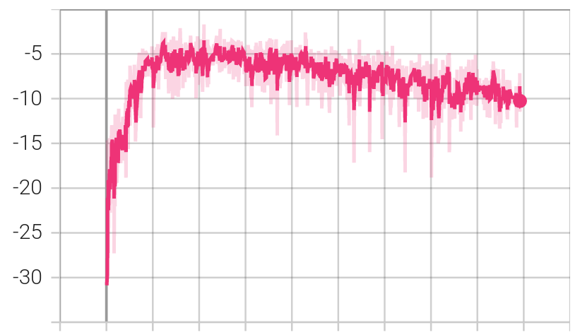
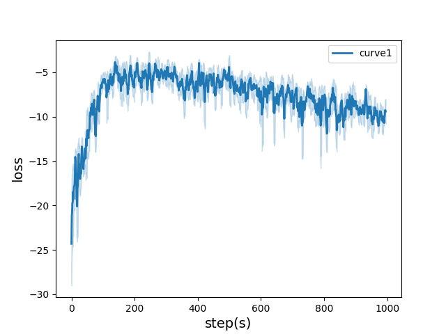
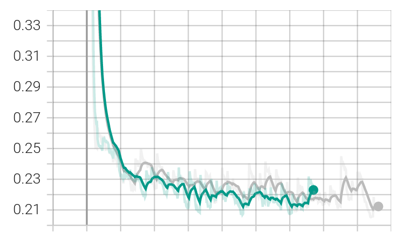
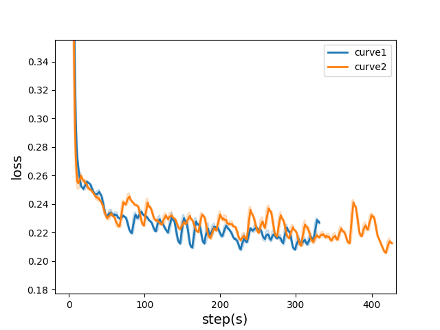

# Training-Curve-Vis

Visualize the training curve from the *.csv file *(tensorboard format)*.

## Feature

- Custom labels
- Curve smoothing
- Support for multiple curves

##### Single curve

| tensorboard                                                  | ours                                                         |
| ------------------------------------------------------------ | ------------------------------------------------------------ |
|  |  |

##### Multiple curves
| tensorboard                                                  | ours                                                         |
| ------------------------------------------------------------ | ------------------------------------------------------------ |
|  |  |

## Usage

```bash
$ pip install -r requirements.txt
```

And then,

```python
from curve_vis import CurveVis
cv = CurveVis(
	csv_file = ["a.csv", "b.csv"]
    labels = ["curve1", "curve2"]
)
cv.show()
```

